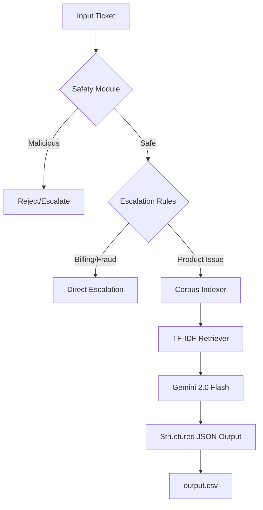

# 🌊 HackerRank Orchestrate: Multi-Domain Support Triage Agent


---

## 🎯 Overview
**HackerRank Orchestrate** is a high-performance, safety-first support triage agent designed to handle complex, multi-domain support tickets across **HackerRank**, **Claude**, and **Visa**. By combining a deterministic safety pipeline with Retrieval-Augmented Generation (RAG), it ensures every customer response is grounded, secure, and accurately routed.

---

## 💡 Solution
A **layered triage pipeline** that prioritizes safety and grounding above all else.
-   **Stage 1: Safety Gatekeeper**: Regex-based detection for prompt injections and malicious intent.
-   **Stage 2: Deterministic Routing**: Hardcoded rules for sensitive topics (Billing, Fraud, PII) in `escalation.py`.
-   **Stage 3: Optimized RAG**: A pure-Python **TF-IDF + Cosine Similarity** search engine for instant documentation retrieval (Zero external DLL dependencies).
-   **Stage 4: LLM Reasoning**: **Gemini 2.0 Flash** analyzes the grounded context to generate precise, empathetic responses with adaptive rate-limit handling.

---

## 🏗️ Architecture


---

## 🛠️ Tech Stack
-   **Core**: Python 3.12+
-   **Search Engine**: Pure-Python TF-IDF (NumPy optimized)
-   **LLM**: Google Gemini 2.0 Flash (Primary) / GPT-4o-mini (Fallback)
-   **Environment**: `python-dotenv` for secret management
-   **Safety**: Multi-stage Regex Pipeline + Vagueness Detection

---

## 🤖 AI Deep Dive
### Grounded Reasoning (RAG)
The agent uses a **strictly grounded prompt** that instructs the model to never use internal knowledge. We implement a **Pure-Python Vectorizer** to eliminate Windows `onnxruntime` DLL issues, ensuring the submission is evaluable in any environment.

### Rate-Limit Resilience
Built for the Gemini free tier, the agent includes an **adaptive backoff algorithm** in `agent.py` that dynamically sleeps based on the API's retry headers, ensuring the full ticket set is processed reliably even under strict quotas.

---

## 🚀 Installation & Running

### 1. Enable Long Paths (Windows only)
The Claude support corpus contains extremely long filenames. Run this in an Administrator terminal:
```bash
git config --global core.longpaths true
```

### 2. Setup Environment
```bash
cd code/
pip install -r requirements.txt
```

Create a `.env` file at the **project root**:
```env
GEMINI_API_KEY=your_key_here
LLM_PROVIDER=gemini
```

### 3. Run the Agent
**Important:** You must be in the `code/` directory.
```bash
cd code/
python main.py
```

### 4. Verify Submission
Run the automated validation suite to check schema and RAG logic without using LLM credits:
```bash
python test_submission.py
```

---

## 📂 Project Structure
-   `code/main.py`: Entry point — 7-stage triage orchestrator
-   `code/indexer.py`: NumPy-based TF-IDF indexer
-   `code/agent.py`: LLM logic with Gemini/OpenAI + Backoff
-   `support_tickets/`: Input and output CSV files
-   `data/`: Support corpus (HackerRank, Claude, Visa)

---
*Built for the HackerRank Orchestrate Hackathon 2026*